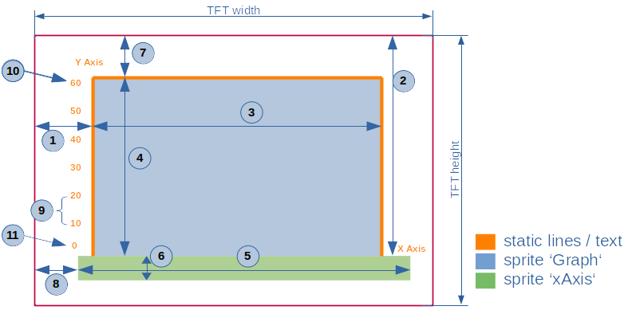

<!-- https://www.markdownguide.org/basic-syntax/ -->
<p align="center">
  <a href="" rel="noopener">
  </a>
</p>

<h1 align="center">ytGraph
</h1>

<h2 align="center">A scrollig and non flickering y/t-graph function set for Arduino/ESP µC
</h2>

 <br> 
 <br> 
 <br> 
 <br> 

# Table of Contents

- [Table of Contents](#table-of-contents)
- [About <a name = "about"></a>](#about-)
- [Features <a name = "features"></a>](#features-)
- [Getting started <a name = "getting-started"></a>](#getting-started-)
  - [Installing <a name = "installing"></a>](#installing-)
  - [Functions in detail <a name = "details"></a>](#functions-in-detail-)
- [Usage <a name="usage"></a>](#usage-)
  - [Settings <a name="settings"></a>](#settings-)
- [Acknowledgements <a name = "acknowledgements"></a>](#acknowledgements-)

<br>
<br> 

# About <a name = "about"></a>

This is a set of functions used to visualize 1 to 16 different time series data on one chart. <br>
The diagram is fully scalable and can be freely positioned on the tft screen.
<br>

<a href="https://www.youtube.com/watch?v=DEbrmliXfTE" rel="">
</a>

<br>
<br>

# Features <a name = "features"></a>
- supports M5Stack and TFT_eSPI() (switch is #useM5STACK)
- compiles under Arduino IDE and PlatformIO
- fully scalable (at runtime you have to change #defines to variables)
- flicker-free scrolling due to the use of sprites (but took up a little more memory)
- the y-axis (time) updates the values ​​automatically (depending on the time format S | M | H | D)
- up to 16 independent channels
- for time series data (only)
- contains a history view (of the size of one graph screen)
- the x-axis is based on interger, only positive values are allowed
- the y-axis is based on float and can be positive and negative
<br> 
<br>  

# Getting started <a name = "getting-started"></a>

## Installing <a name = "installing"></a>
**PlatformIO:**<br>
Compile & upload the code into the controller. Watch the tft-screen.<br><br>

**Arduino IDE:**<br>
Copy the two files ytGraph.cpp/h into a project folder and the main.cpp. <br>
Also copy version.h and ytG_logo.h into the project folder.<br>
With Arduino IDE you have to rename the 'main.cpp' into 'main.ino'.<br>
The folder name must be identical to the *.ino file, eg. "main".<br>

Compile the demo and load it into the µC. Watch the tft-screen.<br>
<br>

## Functions in detail <a name = "details"></a>

There are separate functions for different tasks:

- Draw the y-axis and the frame only once, using standard graphic functions
```cpp
      void ytGraphDrawYaxisFrame(M5Display &d);
```
- Draw the grid and x-axis only once, using two sprites to make it dynamic
```cpp
      void ytGraphDrawGridXaxis(TFT_eSprite &Graph, TFT_eSprite &xAxis, int16_t &LastXGridLinePos);
```
- Draw the dynamic grid seamless to the static one and animate the x-axis 
```cpp
      void ytGraphDrawDynamicGrid(TFT_eSprite &Graph, TFT_eSprite &xAxis, int16_t oox, int16_t &LastXGridLinePos);
```
- Draw the values dynamically according to the sample count and sample rate
```cpp
      void ytGraph(TFT_eSprite &Graph, uint16_t x, int16_t y, uint16_t LineColor, int16_t &ox, int16_t &oy);
```
<br> 
<br>  

# Usage <a name="usage"></a>

All settings are done with #defines in the ytGraph.h file<br>

The number of values ​​displayed in the graphic only depends on the number of SAMPLE_COUNT.<br>
E.g. if there are 60 samples, they will be scaled along the x-axis. If there are only 3 samples, these will also be scaled this way.<br>

To get a flicker-free scrolling, 2 independent sprites are used.
<br>
<br>

## Settings <a name="settings"></a>

The settings are in ytGraph.h<br><br>
</a><br><br>

```c++
#define GRAPH_X_LEFT_POS 40                                   // (1)	
#define GRAPH_Y_BOTTOM_POS 150                                // (2)
#define GRAPH_WIDTH 240                                       // (3)
#define GRAPH_HEIGHT 120                                      // (4)

#define SPRITE_LEFT_X GRAPH_X_LEFT_POS                        // (1)
#define SPRITE_UPPER_Y (GRAPH_Y_BOTTOM_POS - GRAPH_HEIGHT)    // (7)
#define SPRITE_WIDTH GRAPH_WIDTH + 1                          // (3)
#define SPRITE_HEIGTH GRAPH_HEIGHT + 2                        // (4)

#define X_AXIS_WIDTH SPRITE_WIDTH + 50                        // (5)
#define X_AXIS_HEIGTH 15                                      // (6)
#define X_AXIS_LEFT_X GRAPH_X_LEFT_POS - 10                   // (8)
#define X_AXIS_UPPER_Y GRAPH_Y_BOTTOM_POS + 4                 // (2)

#define GRAPH_Y_AXIS_MIN 0.0                                 // (11)
#define GRAPH_Y_AXIS_MAX 60.0                                // (10)
#define GRAPH_Y_DIV 10                                       // (9)

//(same procedure at x-axis:)
#define GRAPH_X_AXIS_MIN 0
#define GRAPH_X_AXIS_MAX (SAMPLE_COUNT * SAMPLE_RATE) // (*)
#define GRAPH_X_DIV 5
// *) The last value of the x-axis is calculated with:   samples * rate   (e.g. 60 samples * 5 sec = 300 sec)
```


<br>
<br>

# Acknowledgements <a name = "acknowledgements"></a>

- This work is inspired from Kris Kasprzak: https://github.com/KrisKasprzak/GraphingFunction

- Thank's to the whole comunnity for sharing their knowledge

- This is my first own contributon ever on Github, so please be gracious with me ;-)